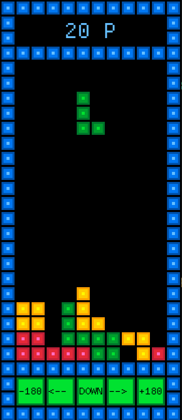

# Tetromino - A Rust Learning Project

This Tetromino game was created as a hands-on project to learn Rust. 


## Screenshot



## About

A simple tetromino game (similar to Tetris) built using the `macroquad` game engine.

## Features

- Randomly generated tetromino pieces
- Basic collision detection
- Mouse-based controls
- Score tracking
- Matrix transformations for rotating tetrominoes by manipulating the 2D grid

## How to Run

1. Clone the repository:
    
    ```sh
    git clone <repo_url>
    cd <repo_name>
    ```
    
2. Install Rust and Cargo if you haven’t already: [Rust Installation](https://www.rust-lang.org/tools/install)
3. Run the game using Cargo:
    
    ```sh
    cargo run --release
    ```
    

---
